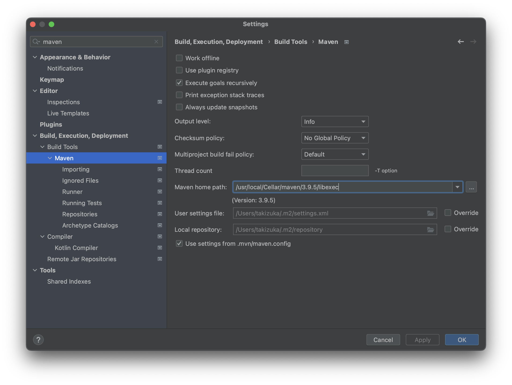
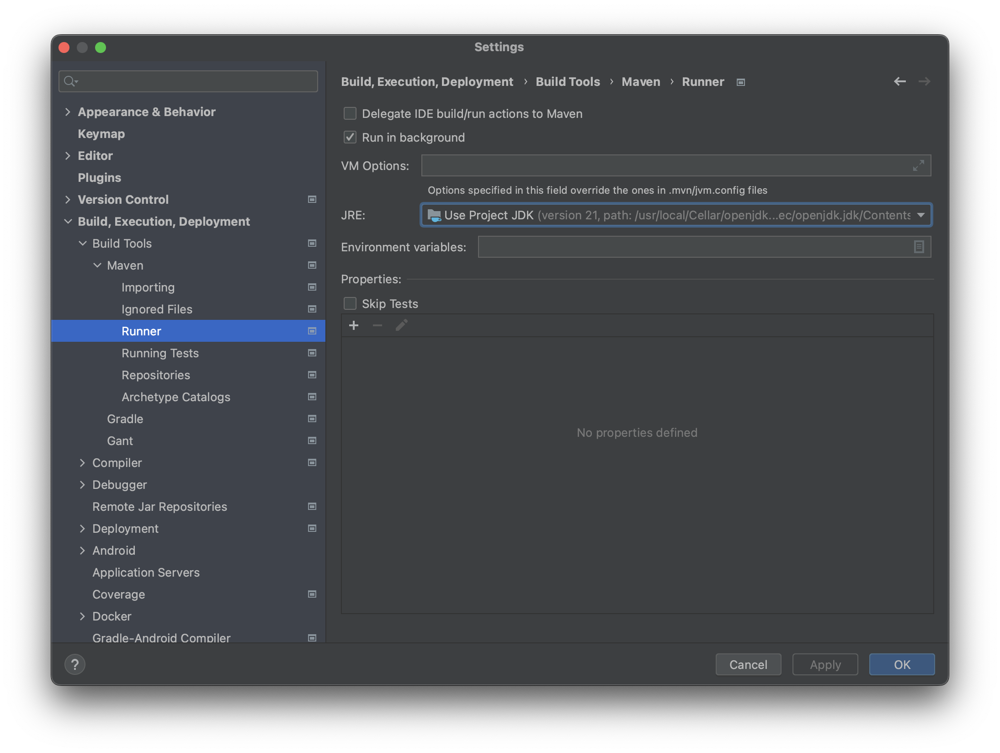
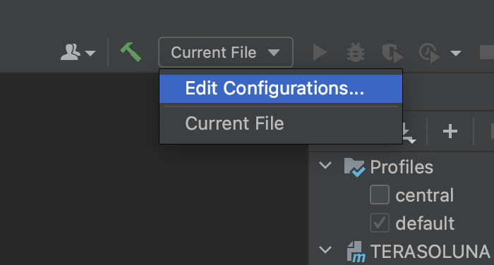
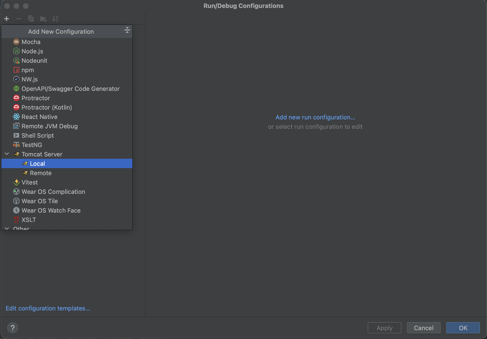
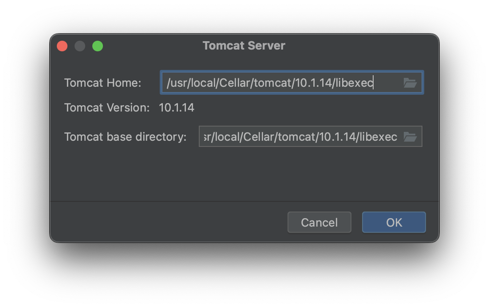
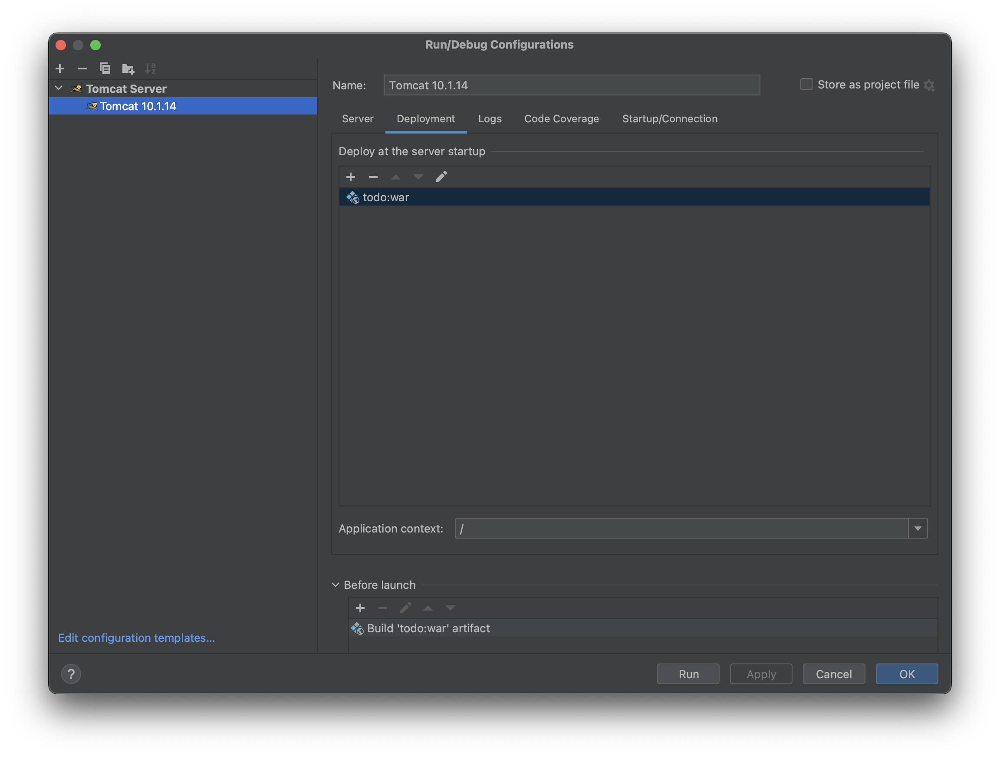
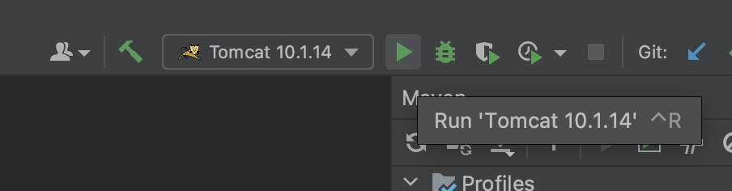

# IntelliJ IDEAの設定

## Maven設定

## JRE設定

## Server設定

- `Application server:` にインストールしたTomcatを設定。
- `URL` に`http://localhost:8080/`を設定。
- `Before launch` の`Build`の次に `Build 'todo:war' artifact` を追加。

## 実行

